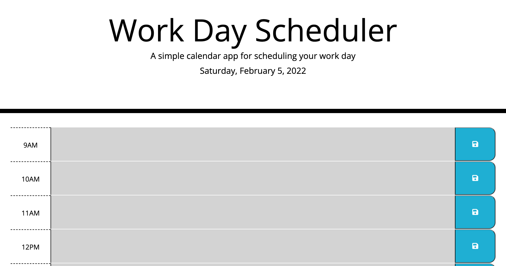
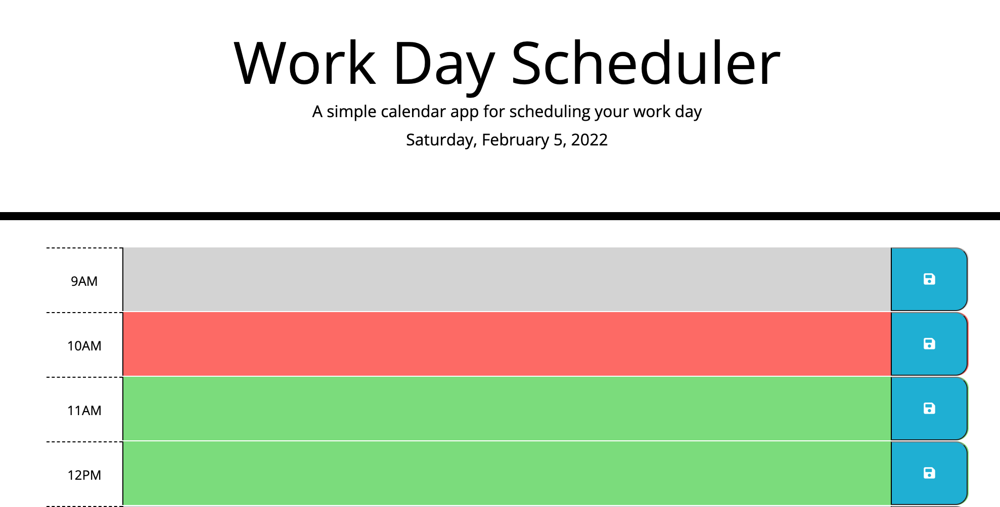

# Work-Day-Scheduler

## Description

This application is a work day scheduler. When application is accessed, the user is presented with the current day within the header. Below are a set of rows labeled from 9am to 5pm that take user input and allow the user to save the input into local storage for later use. For added user experience the application color codes rows depended on the time of day.

##  Usage 

The application was published through github and can be accessed via the provided link below. This application will be receiving UI updates in the future to better accomodate the user. Features that will be added are: automated task time auditing as well as an alert to allow the user to know their tasks have been saved when clicking the save button.

## Other
Instead of using moment.js for the time control of the application I explored an alternative method and decided to incorporate JavaScript Internationalization API as an alternative.

## Links

[Link to Deployed Application](https://armondr.github.io/Work-Day-Scheduler/
)

[Link to Application Repository](https://github.com/ArmondR/Work-Day-Scheduler)

## Screenshots

## Credits

Contributions to the functionality of this application goes to the program TAs: John Titus and Jasper Abarquez for assisting in furthering my understanding of local storage.

### License

______

MIT License

Copyright (c) [2021] [Armond Rodriguez]

Permission is hereby granted, free of charge, to any person obtaining a copy
of this software and associated documentation files (the "Software"), to deal
in the Software without restriction, including without limitation the rights
to use, copy, modify, merge, publish, distribute, sublicense, and/or sell
copies of the Software, and to permit persons to whom the Software is
furnished to do so, subject to the following conditions:

The above copyright notice and this permission notice shall be included in all
copies or substantial portions of the Software.

THE SOFTWARE IS PROVIDED "AS IS", WITHOUT WARRANTY OF ANY KIND, EXPRESS OR
IMPLIED, INCLUDING BUT NOT LIMITED TO THE WARRANTIES OF MERCHANTABILITY,
FITNESS FOR A PARTICULAR PURPOSE AND NONINFRINGEMENT. IN NO EVENT SHALL THE
AUTHORS OR COPYRIGHT HOLDERS BE LIABLE FOR ANY CLAIM, DAMAGES OR OTHER
LIABILITY, WHETHER IN AN ACTION OF CONTRACT, TORT OR OTHERWISE, ARISING FROM,
OUT OF OR IN CONNECTION WITH THE SOFTWARE OR THE USE OR OTHER DEALINGS IN THE
SOFTWARE.

### Badges

____

